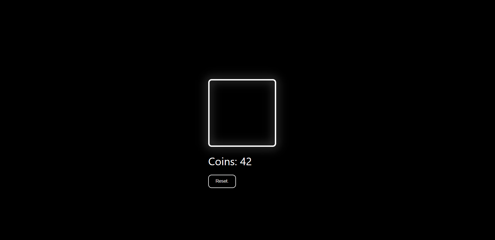

# nothing.

A minimalist browser-based clicker game designed for instant entertainment. Challenge yourself to accumulate as many clicks as possible and beat your high scores!

  

---

## Overview

Test your reflexes and strategy in this addictive one-click game. Your goal is simple: click as fast as you can to increase your wealth and survive the endless challenge.

Features include:
- **Minimalistic Style**: Clean and elegant interface.
- **Infinite Fun**: Keep earning points indefinitely.
- **White Neon Outlines**: Enhance the gaming experience with subtle glowing effects.
- **Save Progress**: Data persists even after closing the tab thanks to `localStorage`.

---

## Getting Started

To play:

1. Clone/download the repository.
2. Open the `index.html` file in your browser.
3. Start clicking the central button to gain points.
  Or..
Join on site allchar.github.io

---

## Customization Options

You can easily customize the game by editing the following variables in the script section:

- `coinsPerClick`: Amount of coins earned per click.
- `startingCoins`: Initial amount of coins upon starting the game.

---

## Built With

- **HTML5**: Responsible for the structure of the game.
- **CSS3**: Handles styling and transitions.
- **JavaScript**: Manages game mechanics and interactions.

---

## Author

Made with ❤️ by **allchar**.  
Feel free to contribute or suggest improvements!

Happy clicking! 😊
